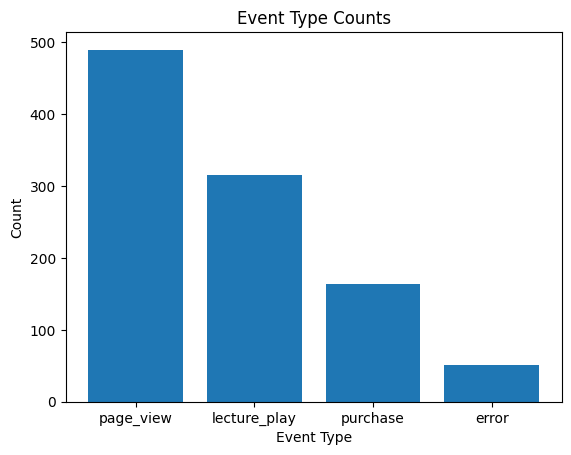
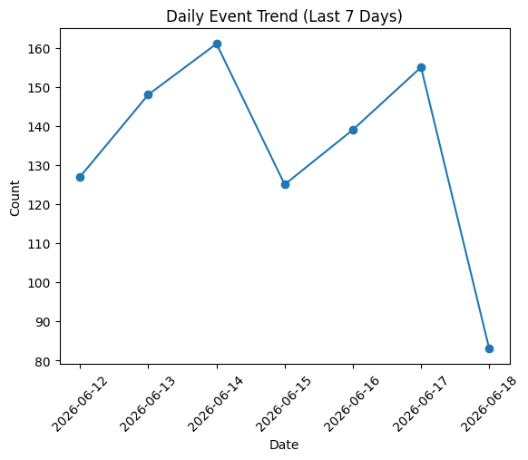
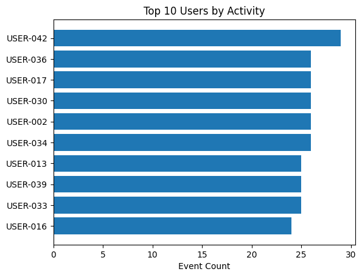
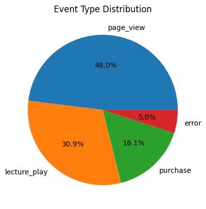
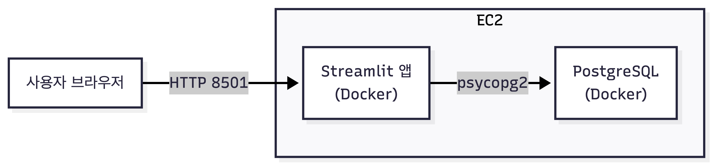
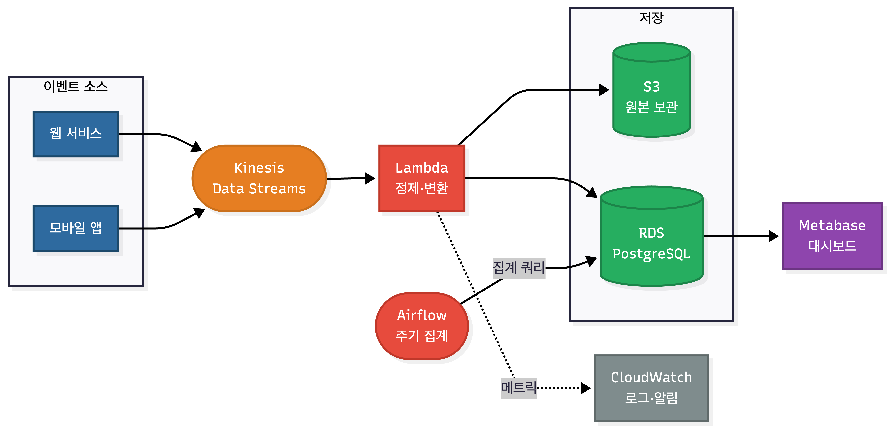

# liveclass-event-pipeline

라이브클래스 도메인의 유저 행동 이벤트를 생성하고 저장·분석·시각화하는 파이프라인.

## 데모

**Streamlit 웹 앱**: http://15.165.33.153:8501

이벤트 타입별 가중치를 슬라이더로 조정하고, 버튼 클릭 시 이벤트를 생성·저장·시각화.

---

## 실행 방법

**필요한 도구**: Docker, Docker Compose

```bash
git clone https://github.com/ohhalim/liveclass-event-pipeline.git
cd liveclass-event-pipeline

cp .env.example .env

docker-compose up
```

Streamlit 앱이 `http://localhost:8501`에서 실행됩니다.

---

## 이벤트 설계

라이브클래스 도메인 기반 4가지 이벤트 타입.

| 타입 | 설명 | 전용 필드 |
|------|------|-----------|
| `page_view` | 강의 페이지 조회 | `page_url` |
| `lecture_play` | 강의 영상 재생 | `lecture_id` |
| `purchase` | 강의 구매 | `lecture_id`, `amount` |
| `error` | 에러 발생 | `error_code` |

실제 서비스 트래픽 패턴을 반영해 가중치 적용: `page_view` 50% / `lecture_play` 30% / `purchase` 15% / `error` 5%

---

## 스키마 설명

```sql
CREATE TABLE events (
    id          SERIAL PRIMARY KEY,
    event_type  VARCHAR(50) NOT NULL,
    user_id     VARCHAR(50) NOT NULL,
    session_id  VARCHAR(50) NOT NULL,
    lecture_id  VARCHAR(50),
    page_url    TEXT,
    amount      NUMERIC(10, 2),
    error_code  VARCHAR(50),
    created_at  TIMESTAMP NOT NULL DEFAULT NOW()
);
```

이벤트 타입을 단일 테이블로 수용하는 와이드 테이블 구조. 타입별 테이블 분리 시 집계 쿼리마다 JOIN이 필요한 반면, 이 구조에서는 GROUP BY만으로 처리 가능. 타입별 전용 컬럼은 NULL 허용.

PostgreSQL은 집계 함수, 윈도우 함수 등 분석 쿼리를 편하게 사용할 수 있어 선택.

---

## 시각화 결과









---

## 구현하면서 고민한 점

**환경변수 기본값 제거**
`os.getenv("DB_HOST", "localhost")`처럼 기본값을 두면 설정 누락 시 오류 없이 넘어가 문제를 늦게 발견. `os.environ[]`으로 바꿔 미설정 시 즉시 실패하도록 설계.

**docker-compose depends_on**
`depends_on`만으로는 PostgreSQL이 시작됐다는 것만 확인. 초기화가 끝나기 전에 앱이 연결을 시도해 실패. `pg_isready` health check로 DB가 준비된 후 앱이 실행되도록 변경.

**matplotlib Docker 환경**
기본 백엔드는 화면 창을 띄우려 하지만 컨테이너에는 디스플레이가 없어 크래시. `matplotlib.use("Agg")`로 파일 출력 전용 백엔드로 변경.

---

## 선택 과제 B — AWS 아키텍처

### 현재 구성 (이 과제)



### 실제 운영 환경이라면



### 사용 서비스 및 선택 이유

| 서비스 | 역할 | 선택 이유 |
|--------|------|-----------|
| **Kinesis** | 실시간 이벤트 수집 | 서비스에서 발생하는 이벤트를 유실 없이 버퍼링. SQS와 달리 스트림을 여러 컨슈머가 동시에 읽을 수 있어 확장성이 높음 |
| **Lambda** | 이벤트 정제·변환 | 서버 관리 없이 이벤트 단위로 실행. 트래픽이 없을 때 비용이 0 |
| **S3** | 원본 이벤트 보관 | 변환 전 raw 데이터를 저장해두면 스키마 변경 시 재처리 가능. 저장 비용이 낮음 |
| **RDS PostgreSQL** | 집계용 DB | 관리형 서비스로 백업·패치·페일오버를 AWS가 처리. EC2에 직접 올리는 것 대비 운영 부담이 낮음 |
| **Airflow** | 파이프라인 스케줄링 | 집계 쿼리 실행·차트 갱신 등 주기 작업을 DAG로 관리. 실패 시 재시도·알림이 내장되어 있음 |
| **Metabase** | 대시보드 | SQL만 연결하면 차트·대시보드를 바로 구성 가능. Streamlit처럼 코드를 짤 필요 없고 비개발자도 사용 가능 |
| **CloudWatch** | 로그·알림 | 에러 이벤트 급증 등 이상 패턴 감지 시 알림. 별도 인프라 없이 AWS 콘솔에서 통합 관리 |

### 아키텍처에서 가장 고민한 부분

DB를 EC2에 직접 올릴지 RDS로 분리할지가 가장 큰 고민이었다. EC2 하나에 앱과 DB를 함께 올리면 구성이 단순하지만, 서버 장애 시 DB도 같이 내려간다. RDS로 분리하면 DB 계층의 가용성과 백업을 독립적으로 관리할 수 있어 운영 안정성이 높아진다. 이 과제 규모에서는 EC2 단일 구성으로 시작하되, 트래픽이 늘어나면 RDS로 마이그레이션하는 방향이 현실적이라고 판단했다.
